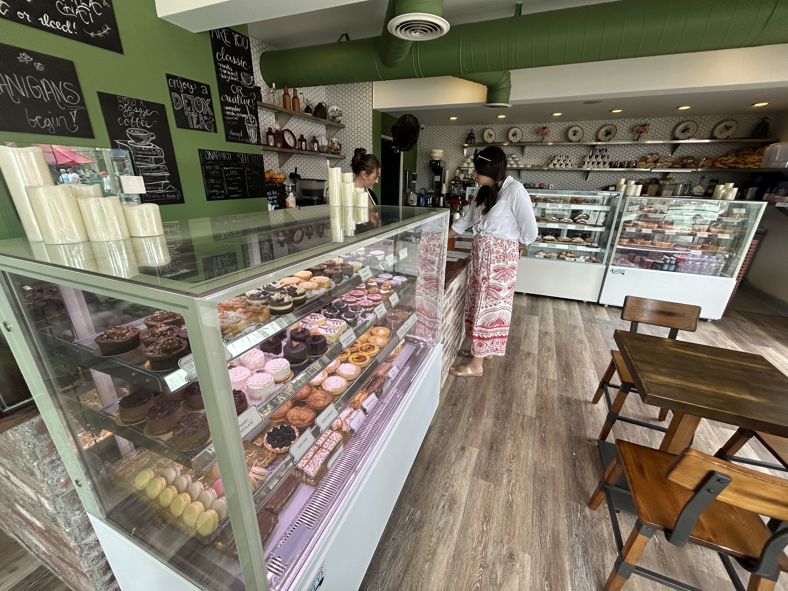
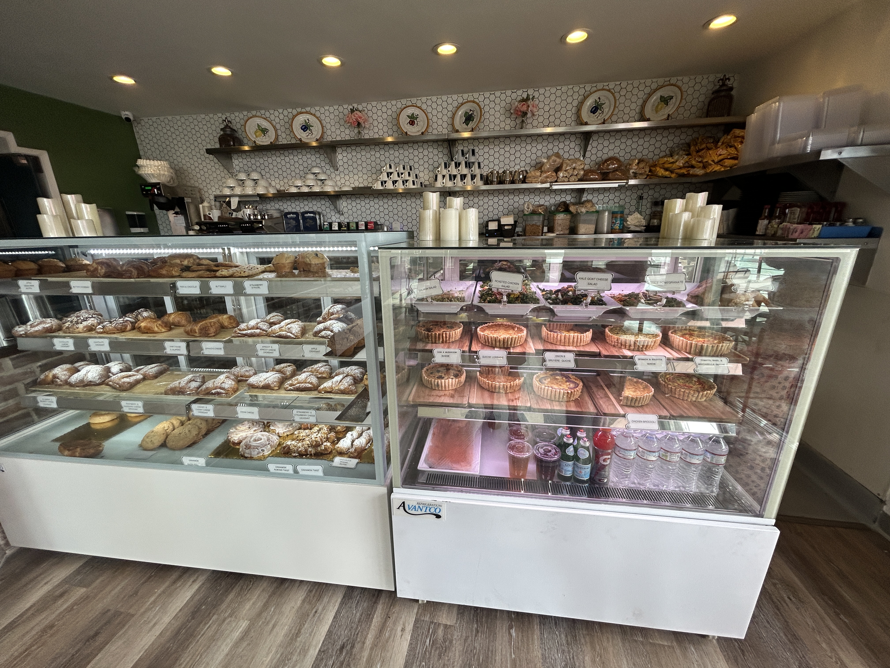

Awesome little french cafe on Hermosa Pier, neat spot, tons of delicious looking baked goods; desserts, breakfast pastries, quiche.

| | |
| --------- | -------- |
|  |  |' |

Pretty solid coffee overall. Cousin Ryan enjoyed his drip black coffee, and my cappucino was okay. Excessive steamed milk, like 4", not complaining although it ended up being more of a latte than cappucino.