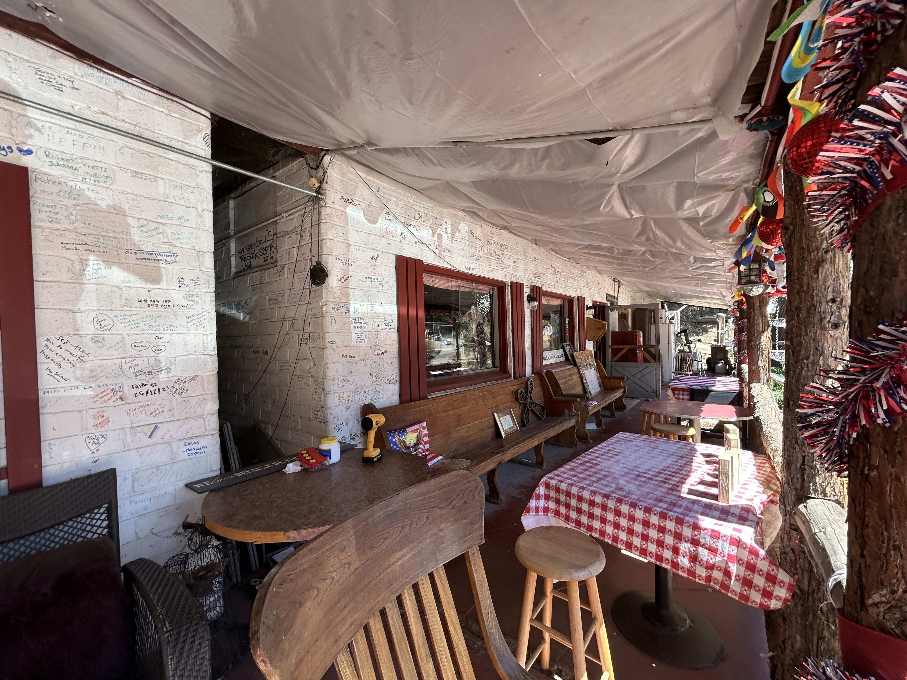
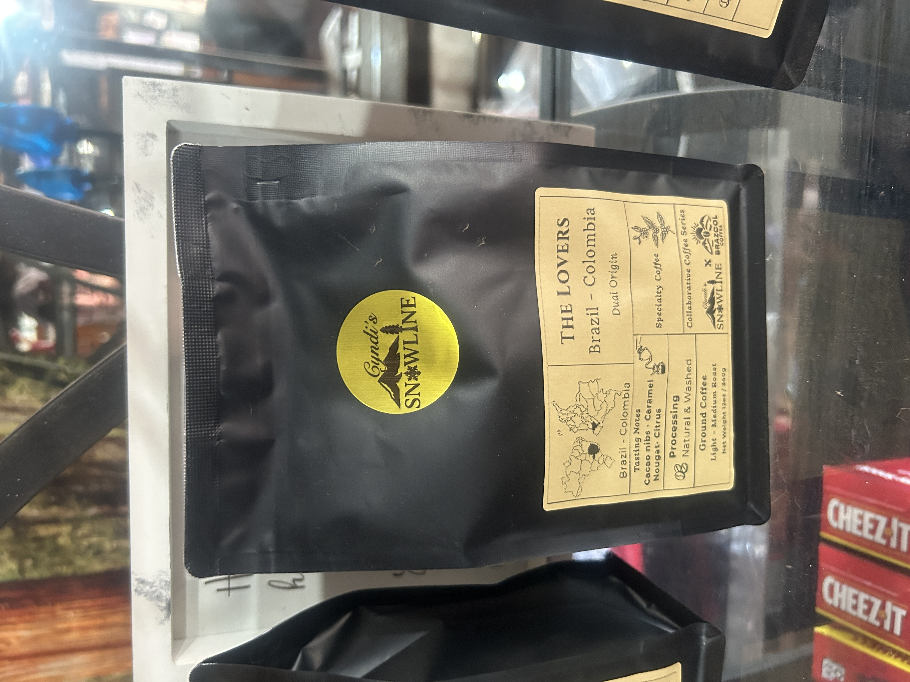

Fairly delapitated coffee shop near King's Canyon. The building is in various states of disrepair and desparately need some love. The coffee shop here has 100% of proceeds going towards a repair fund for the lodge. 
Lodge looks like it has good bones, and a story to tell underneath the disrepair. Looks like it would have been a pretty cool place once apon a time.

| | |
| --------- | -------- |
|  |  |' |
